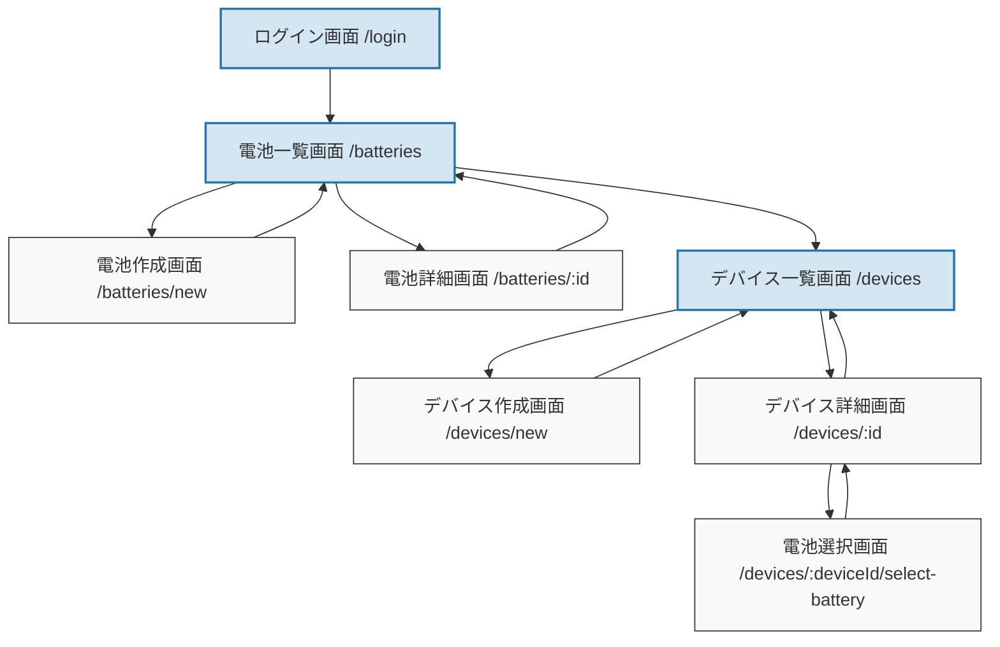

# 電池＆デバイス管理アプリ

電池とデバイスを効率的に管理するためのウェブアプリケーションです。

> **注意**: このプロジェクトは元々Next.jsで構築されていましたが、Vite+ReactのSPAアプリに移行されました。

## 機能

- 電池の登録・管理（充電池/使い切り）
- デバイスの登録・管理
- 電池の使用状況の追跡
- 電池交換履歴の記録
- ユーザープランによるリソース制限（無料/プレミアム/ビジネス）

## ユーザープラン

このアプリケーションでは、ユーザーごとに管理できるリソースに制限を設けています：

- **無料プラン**
  - 電池グループ：最大5つまで
  - デバイス：最大5つまで
- **プレミアムプラン**（開発中）
  - 電池グループ：拡張された上限
  - デバイス：拡張された上限
  - 追加機能（予定）
- **ビジネスプラン**（開発中）
  - 電池グループ：無制限
  - デバイス：無制限
  - 高度な分析機能（予定）

## 技術スタック

- Vite
- React
- TypeScript
- Tailwind CSS
- Supabase (認証・データベース・ストレージ)

## 画面構成と機能

### 電池管理
- **電池一覧画面** (`/batteries`)
  - 電池グループの一覧表示
    - カード全体をクリックすると詳細画面に遷移
    - 電池形状と本数の視覚的表示
    - 電池状態（充電済み、使用中、空、廃棄）の視覚的表示
    - 設置中デバイスの表示（同じデバイスについては本数をまとめて表示）
  - 電池タイプと種類によるフィルタリング
  - 検索機能とソート機能
  - 新規電池登録画面へのリンク
- **電池作成画面** (`/batteries/new`)
  - 電池グループの新規登録
  - 電池の種類、本数、電圧などの設定
- **電池詳細画面** (`/batteries/:id`)
  - 電池グループの詳細情報表示
  - 電池グループの編集(編集モード)・削除
    - 電池がデバイスに設定されている場合、電池の種類や本数などは変更できない(編集モードには移行可能)
  - 個々の電池の状態表示

### デバイス管理
- **デバイス一覧画面** (`/devices`)
  - デバイスの一覧表示（電池設定済み/未設定で分類）
  - デバイス種別、電池種別によるフィルタリング
  - 交換予定日や交換日による並び替え
  - 新規デバイス登録画面へのリンク
- **デバイス作成画面** (`/devices/new`)
  - デバイスの新規登録
  - デバイスタイプ、使用電池、必要本数などの設定
- **デバイス詳細画面** (`/devices/:id`)
  - デバイスの詳細情報表示
  - デバイスの編集
  - デバイスに設定されている電池の表示
  - 電池交換履歴の表示
  - 電池選択画面へのリンク
  - コンポーネント構成:
    - 状態管理: `deviceDetailStore.ts` (Zustand)
    - UI: 複数の小コンポーネントに分割（ヘッダー、画像、各種情報表示、電池セクションなど）
- **電池選択画面** (`/devices/:deviceId/select-battery`)
  - デバイスに設定する電池の選択
  - 電池の状態や種類によるフィルタリング
  - 選択した電池の確定

### 認証
- **ログイン画面** (`/login`)
  - Supabaseを使用した認証

## コンポーネント設計

このプロジェクトでは、大きなコンポーネントを適切に分割し、保守性と再利用性を高めています。

### コンポーネント分割の例

#### 電池詳細画面
- `BatteryDetail.tsx` - メインコンポーネント
- `BatteryDetailElemHead.tsx` - ヘッダー部分
- `BatteryDetailImage.tsx` - 画像表示部分
- `BatteryDetailElemShape.tsx` - 形状表示部分
- その他の情報表示コンポーネント

#### デバイス詳細画面
- `DeviceDetail.tsx` - メインコンポーネント
- `DeviceDetailElemHead.tsx` - ヘッダー部分
- `DeviceDetailImage.tsx` - 画像表示部分
- `DeviceDetailElemType.tsx` - デバイスタイプ表示部分
- `DeviceDetailElemBatteryShape.tsx` - 電池形状表示部分
- その他の情報表示コンポーネント

### 状態管理
- Zustandを使用した状態管理ストア
  - `batteryDetailStore.ts` - 電池詳細画面の状態管理
  - `deviceDetailStore.ts` - デバイス詳細画面の状態管理

## コード構造

このプロジェクトでは、データフェッチングと状態管理の責任を明確に分離しています。

### ファイル構造

```
src/lib/
├── query.ts     - データフェッチング (React Query)
├── store.ts     - 状態管理 (Zustand)
└── hooks.ts     - UIロジック + 後方互換性
```

### 各ファイルの役割

#### query.ts
- React Queryを使ったデータフェッチングのみを担当
- 各APIエンドポイントに対応するクエリフックを提供
- 例: `useBatteryGroupsQuery`, `useDeviceQuery`など

#### store.ts
- Zustandを使った状態管理を担当
- クエリ結果をストアに反映するロジックを提供
- 例: `useBatteryGroupsStore`, `useDeviceStore`など

#### hooks.ts
- UIロジックに特化したフックを提供
- 後方互換性のために既存のフック名をエクスポート
- 実際の実装はstore.tsに移動

### データフロー

1. `query.ts` - APIからデータをフェッチ
2. `store.ts` - フェッチしたデータをZustandストアに保存
3. コンポーネント - `hooks.ts`経由でデータにアクセス

### 命名規則

- データフェッチング: `use〇〇Query`
- Zustandストア: `use〇〇Store`
- 後方互換性: `use〇〇`（内部的にはStoreを使用）

## 画面遷移



## 開発環境のセットアップ

1. リポジトリをクローン

```bash
git clone https://github.com/yourusername/battery-management-app.git
cd battery-management-app
```

2. 依存関係をインストール

```bash
npm install
```

3. 環境変数の設定

`.env.example` ファイルを `.env` にコピーして、Supabase の認証情報を設定します。

```bash
cp .env.example .env
```

`.env` ファイルを編集して、Supabase の URL と匿名キーを設定します。

4. 開発サーバーを起動

```bash
npm run dev
```

ブラウザで http://localhost:5173 を開いてアプリケーションにアクセスできます。

## デプロイ

このアプリケーションは Netlify などのサービスに簡単にデプロイできます。デプロイ時には、環境変数を適切に設定してください。

## 移行情報

このプロジェクトは元々Next.jsで構築されていましたが、以下の理由でVite+ReactのSPAアプリに移行されました：

- より高速な開発環境
- シンプルなSPA構成への移行
- クライアントサイドのみの実装に焦点を当てる

主な変更点：
- Next.jsのルーティングからReact Router Domへの移行
- サーバーサイドコンポーネントの削除
- ミドルウェアの削除
- ビルド設定の更新

## 用語集

このアプリケーションで使用される主要な用語と概念の説明です。

### 電池関連

- **電池グループ**: 同じ種類・形状の電池をまとめて管理する単位です。例えば「リビングルーム用単3形充電池（4本）」などの形で管理されます。
- **電池の種類（kind）**: 
  - **使い捨て（disposable）**: 一度使用したら廃棄する電池
  - **充電式（rechargeable）**: 繰り返し充電して使用できる電池
- **電池の形状（shape）**: 
  - **単1形**: 大型の円筒形電池
  - **単2形**: 中型の円筒形電池
  - **単3形**: 最も一般的な円筒形電池
  - **単4形**: 小型の円筒形電池
  - **9V形**: 四角い形状の9ボルト電池
- **電池の状態（status）**: 
  - **充電済み（charged）**: 充電が完了し使用可能な状態
  - **使用中（in_use）**: デバイスに設置されて使用されている状態
  - **空（empty）**: 電力が消費され、充電または交換が必要な状態
  - **廃棄（disposed）**: 使用不可で廃棄予定の状態

### デバイス関連

- **デバイスタイプ（type）**: 
  - **スマートフォン/リモコン（smartphone）**: スマートフォンやリモコンなどの小型電子機器
  - **スピーカー（speaker）**: ワイヤレススピーカーなどの音響機器
  - **カメラ（camera）**: デジタルカメラなどの撮影機器
  - **ガジェット（gadget）**: 各種小型電子機器
  - **ライト（light）**: 懐中電灯などの照明機器
  - **おもちゃ（toy）**: 電池で動作するおもちゃ
- **電池寿命**: デバイスの電池交換サイクル（週単位で設定）
- **電池交換履歴**: デバイスの電池交換記録（日時と使用された電池の情報）

### システム全般

- **電池交換予定日**: 電池寿命に基づいて計算される次回交換予定日。交換時期の状態に応じて色分けされます：
  - **赤色**: 交換予定日を超過している場合
  - **黄色**: 交換予定日まで1週間以内の場合
  - **青色**: 交換予定日まで1週間以上ある場合
- **電池スロット**: デバイス内の電池設置場所。スロット番号で管理されます。
- **電池使用履歴**: 電池がどのデバイスでいつからいつまで使用されたかの記録。
- **ユーザープラン**: ユーザーごとに設定される利用プラン。管理できるリソース（電池グループ、デバイス）の数に制限があります。

## 環境変数

このプロジェクトでは以下の環境変数を使用しています：

- `VITE_SUPABASE_URL`: Supabase プロジェクトの URL
- `VITE_SUPABASE_ANON_KEY`: Supabase の匿名キー

## ライセンス

[MIT](LICENSE)
