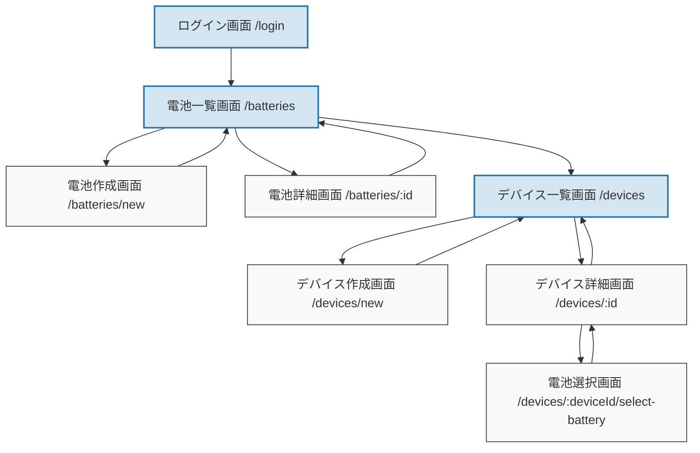

# 電池＆デバイス管理アプリ

電池とデバイスを効率的に管理するためのウェブアプリケーションです。

> **注意**: このプロジェクトは元々Next.jsで構築されていましたが、Vite+ReactのSPAアプリに移行されました。

## 機能

- 電池の登録・管理（充電池/使い切り）
- デバイスの登録・管理
- 電池の使用状況の追跡
- 電池交換履歴の記録

## 技術スタック

- Vite
- React
- TypeScript
- Tailwind CSS
- Supabase (認証・データベース・ストレージ)

## 画面構成と機能

### 電池管理
- **電池一覧画面** (`/batteries`)
  - 電池グループの一覧表示
    - カード全体をクリックすると詳細画面に遷移
    - 電池形状と本数の視覚的表示
    - 電池状態（充電済み、使用中、空、廃棄）の視覚的表示
    - 設置中デバイスの表示（同じデバイスについては本数をまとめて表示）
  - 電池タイプと種類によるフィルタリング
  - 検索機能とソート機能
  - 新規電池登録画面へのリンク
- **電池作成画面** (`/batteries/new`)
  - 電池グループの新規登録
  - 電池の種類、本数、電圧などの設定
- **電池詳細画面** (`/batteries/:id`)
  - 電池グループの詳細情報表示
  - 電池グループの編集(編集モード)・削除
    - 電池がデバイスに設定されている場合、電池の種類や本数などは変更できない(編集モードには移行可能)
  - 個々の電池の状態表示

### デバイス管理
- **デバイス一覧画面** (`/devices`)
  - デバイスの一覧表示（電池設定済み/未設定で分類）
  - デバイス種別、電池種別によるフィルタリング
  - 交換予定日や交換日による並び替え
  - 新規デバイス登録画面へのリンク
- **デバイス作成画面** (`/devices/new`)
  - デバイスの新規登録
  - デバイスタイプ、使用電池、必要本数などの設定
- **デバイス詳細画面** (`/devices/:id`)
  - デバイスの詳細情報表示
  - デバイスの編集
  - デバイスに設定されている電池の表示
  - 電池交換履歴の表示
  - 電池選択画面へのリンク
- **電池選択画面** (`/devices/:deviceId/select-battery`)
  - デバイスに設定する電池の選択
  - 電池の状態や種類によるフィルタリング
  - 選択した電池の確定

### 認証
- **ログイン画面** (`/login`)
  - Supabaseを使用した認証

## 画面遷移



## 開発環境のセットアップ

1. リポジトリをクローン

```bash
git clone https://github.com/yourusername/battery-management-app.git
cd battery-management-app
```

2. 依存関係をインストール

```bash
npm install
```

3. 環境変数の設定

`.env.example` ファイルを `.env` にコピーして、Supabase の認証情報を設定します。

```bash
cp .env.example .env
```

`.env` ファイルを編集して、Supabase の URL と匿名キーを設定します。

4. 開発サーバーを起動

```bash
npm run dev
```

ブラウザで http://localhost:5173 を開いてアプリケーションにアクセスできます。

## デプロイ

このアプリケーションは Netlify などのサービスに簡単にデプロイできます。デプロイ時には、環境変数を適切に設定してください。

## 移行情報

このプロジェクトは元々Next.jsで構築されていましたが、以下の理由でVite+ReactのSPAアプリに移行されました：

- より高速な開発環境
- シンプルなSPA構成への移行
- クライアントサイドのみの実装に焦点を当てる

主な変更点：
- Next.jsのルーティングからReact Router Domへの移行
- サーバーサイドコンポーネントの削除
- ミドルウェアの削除
- ビルド設定の更新

## 環境変数

このプロジェクトでは以下の環境変数を使用しています：

- `VITE_SUPABASE_URL`: Supabase プロジェクトの URL
- `VITE_SUPABASE_ANON_KEY`: Supabase の匿名キー

## ライセンス

[MIT](LICENSE)
